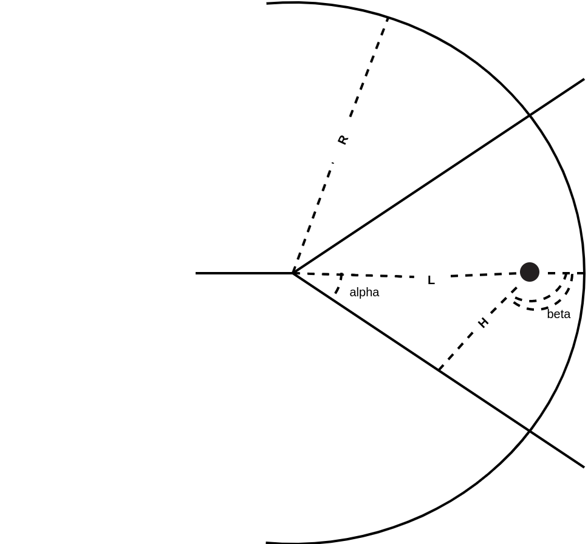

## All methods list with some information 

## Multiple point methods
#### Method 1

min(sum(sin(alpha_i)))

[comment]: (\min_N\sum_{i=0}^n{\sin{\alpha_{i}}})

#### Method 2

min(sum(H_i))

[comment]: (\min_N\sum_{i=0}^n{H_i})

#### Method 3

min(sum(sin(beta_i)) == sum(pi-sin(alpha_i)))

[comment]: (\min_N\sum_{i=0}^n{(\pi - \sin{\alpha_{i})}})

#### Method 4

min(sum(L_i * H_i))

[comment]: (\min_N\sum_{i=0}^n{L_i \cdot H_i})

#### Method 5

min(sum(H/(L * (i + 1))))

[comment:] (\min_N\sum_{i=0}^n{\frac{H_i}{L_i \cdot (i+1)}})

#### Method 6

min(sum(H * i))

[comment]: (\min_N\sum_{i=0}^n{H_i \cdot i})

## Single point methods

#### method 7

min(H_(-1))

(-1 == last point)

[comment]: (\min_N H_{n})